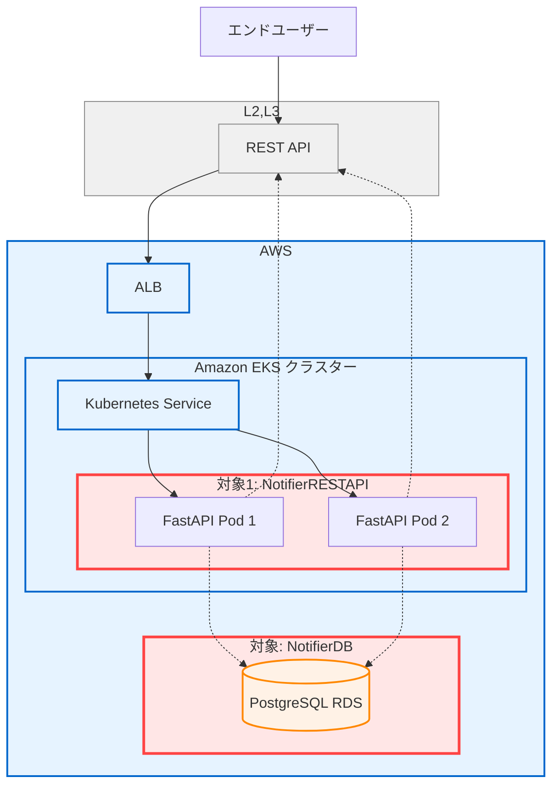
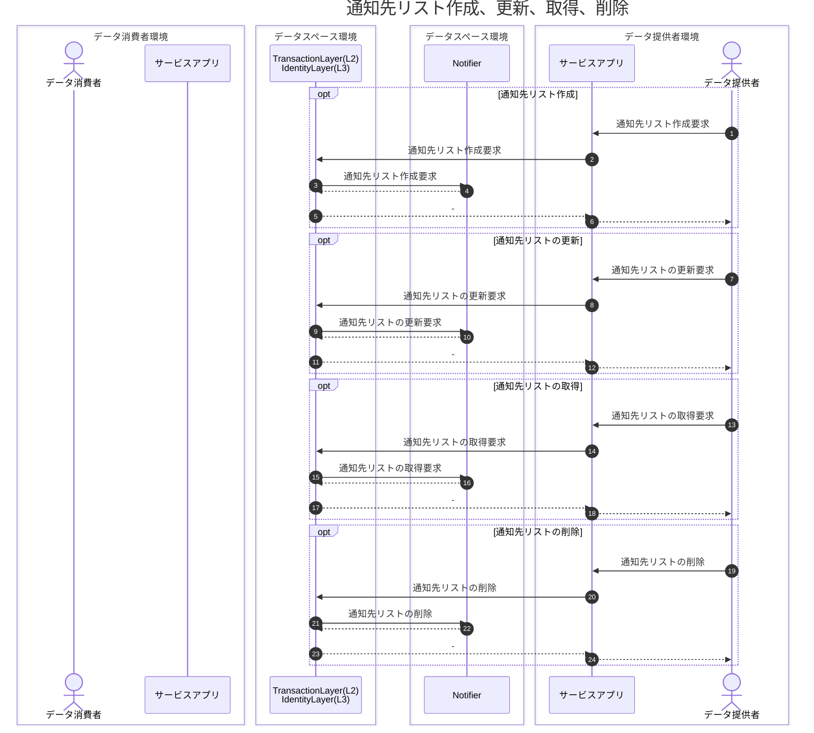
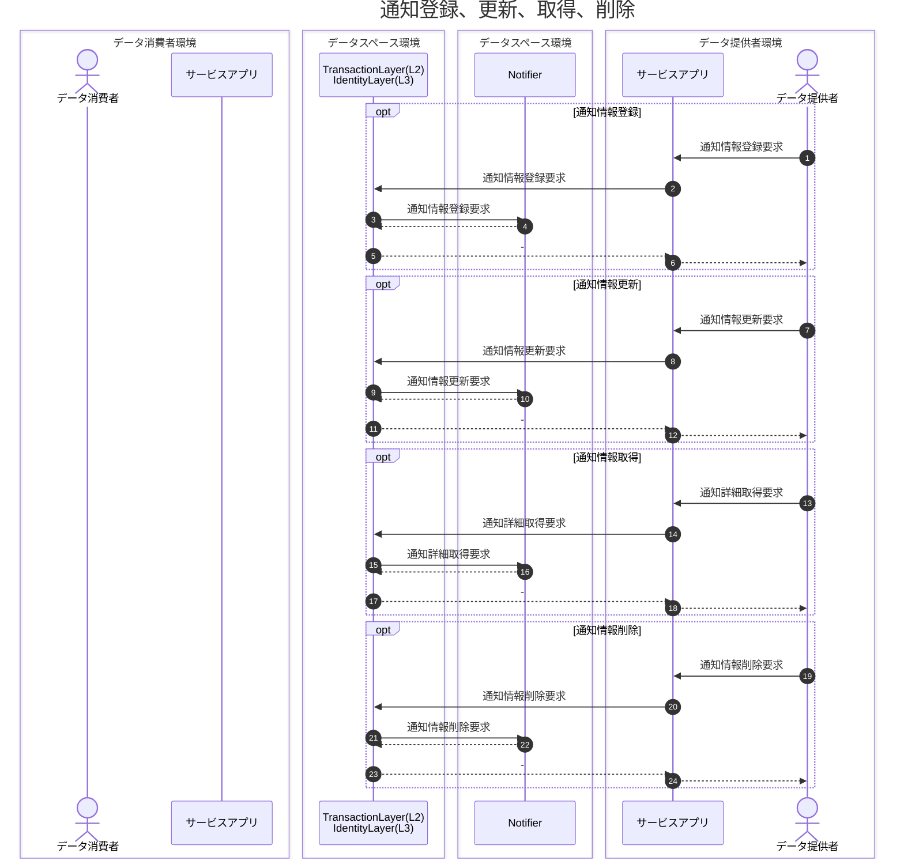
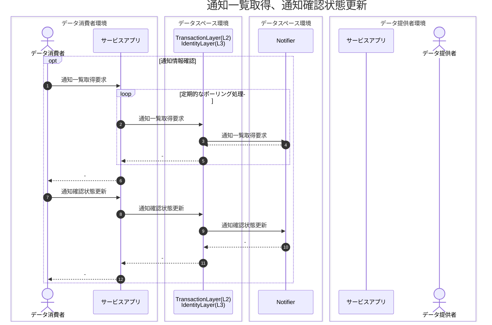
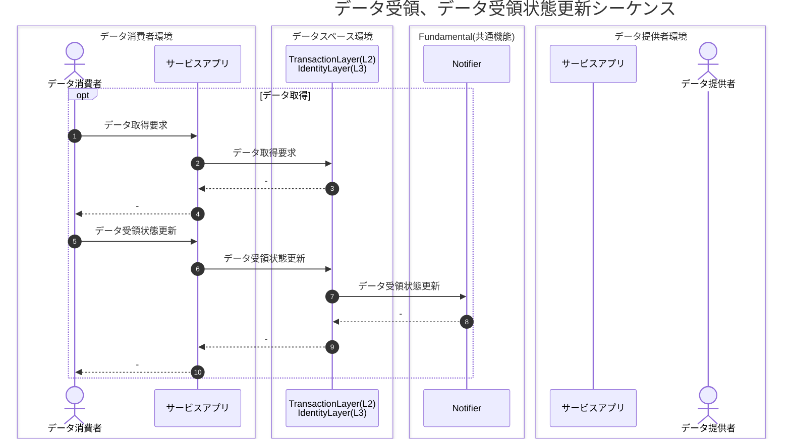
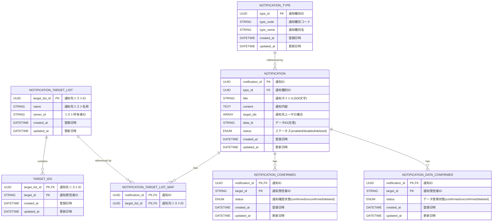

# Notifier 基本設計書

## 1. システム概要

### 1.1 目的・背景

本ソフトウェアは、ウラノス・エコシステム・データスペーシズの共通機能（Common Functionalities）の一つとして動作し、
提供者からのデータ配信の通知を管理するAPIサーバである。
通知先リストを作成・更新・削除し、通知送信、通知確認、通知状態更新、データ状態更新を可能とする。

### 1.2 適用範囲 / 非対象

* **対象**: NotifierのAPIサーバ、Notifierのデータベースが対象
* **非対象**: 認証機能は、L3 Identity Component、データ送受信機能は、L2 Transactionの機能のため対象外


### 1.3 システム構成概要
- **APIフレームワーク**: FastAPI (Python 3.11+)
- **データベース**: PostgreSQL 18
- **コンテナ基盤**: Docker / Kubernetes

### 1.4 前提・制約

* 認証機能は、アイデンティティレイヤ（L3）との連携を前提とするため、本システムの対象外
* 通信は **TLS** 前提（Ingress で終端、Pod→DB も TLS）。
* TLS終端は、本ソフトウェアの外部で行うため対象外
* 認可ポリシーは OpenFGAを使用し管理

---

## 2. アーキテクチャ

### 2.1 全体構成と対象


### 2.2 主要コンポーネントと責務

* NotifierAPIとNotifierDBが本ソフトウェアの対象
* NotifierAPIは、EKS(Kubernetes)上のPodとして動作する。
* NotifierDBは、AWSのRDS(PostgreSQL)として動作し、Notifierの通知先リスト、通知情報を保持する
* 認証は、L3 Identity ComponentのKeyCloakの認証機能を使用する。
* NotifierAPIは、L2 Transactionを介して呼び出される。
* 認可情報は、Notifier内のJsonファイルとして保持する。

---

## 3. シーケンス

### 3.1 通知先リスト作成、更新、取得、削除シーケンス



### 3.2 通知登録、更新、取得、削除シーケンス



### 3.3 通知情報確認、通知確認状態更新シーケンス



### 3.4 データ受領、データ受領状態更新シーケンス



## 4. API 設計（概要）

### 4.1 共通仕様

* **API方式**: REST API
* **Base URL**: `/api/v1`
* **バージョン管理**: URL版管理方式（/v1）
* **認証**: `Authorization: Bearer <JWT>`
* **リクエスト形式**: 
  - Content-Type: `application/json`
  - 文字エンコーディング: UTF-8
* **レスポンス形式**: 
  - Content-Type: `application/json; charset=utf-8`
  - エラーレスポンス: RFC 9457 準拠
* **日時フォーマット**: ISO 8601 (YYYY-MM-DDTHH:mm:ss.sssZ)


### 4.2 REST API エンドポイント

| メソッド   | パス                                 | 説明                      |
| ------ | ---------------------------------- | ----------------------- |
| GET    | `/api/v1/notification-targets`             | 通知先リスト一覧取得 |
| POST    | `/api/v1/notification-targets`        | 通知先リスト作成             |
| GET    | `/api/v1/notification-targets/{target_list_id}`        | 通知先リスト取得(ID指定)             |
| PUT    | `/api/v1/notification-targets/{target_list_id}`        | 通知先リスト更新             |
| DELETE    | `/api/v1/notification-targets/{target_list_id}`        | 通知先リスト削除             |
| POST    | `/api/v1/notifications`        | 通知登録            |        |
| GET    | `/api/v1/notifications/{notification_id}`        | 通知詳細取得 |
| GET    | `/api/v1/notifications`        | 通知一覧取得            |
| PUT    | `/api/v1/notifications/{notification_id}`        | 通知更新            |
| DELETE    | `/api/v1/notifications/{notification_id}`        | 通知削除            |
| PUT    | `/api/v1/notifications/{notification_id}/receive`        | 通知確認状態更新            |
| PUT    | `/api/v1/notifications/{notification_id}/data/{data_id}/receive`        | データ受領状態更新           |

### 4.3 エラーレスポンス

#### (1) ステータスコード

| コード | 説明 | 対象メソッド | 備考 |
|-------|------|------------|------|
| 400 | Bad Request 不正なリクエスト | すべて | 他の400番台に相応しいコードがない場合に使用 |
| 401 | Unauthorized　認証失敗 | すべて | アクセストークン検証に失敗した場合 |
| 403 | Forbidden　認可失敗 | すべて | 認可チェックにより該当ユーザにAPI実行権限がない場合 |
| 404 | Not Found　指定したリソースはない | すべて | APIにて指定したリソースがない場合|
| 409 | Conflict　リソースの競合 | POST, PUT, DELETE | 既に存在するリソースとの競合や、リソースの状態による処理不可の場合|
| 422 | Validation Error バリデーションエラー | すべて | リクエスト形式は正しいが、セマンティックエラーがある場合|
| 500 | Internal Server Error システムエラー | すべて | サーバ起因のエラー |

#### (2) レスポンスボディ
- RFC 9457 に準拠する
```json
{
  "type": "/ouranos/errors/validation-error", # URI形式のエラーコード
  "title": "エラー名称", # エラー名称 
  "detail": "xxx...", # エラーの説明
  "instance": "/api/v1/xx", # 問題の発⽣したリソースのURI
  "status": 403　# ステータスコード
}
```

---

## 5. 認証・認可設計

### 5.1 認証、認可前提

- 認証は、 L3 Identity Componentにて実施。本ソフトウェアの対象外。
- L3 Identity Componentとの認証フローにより取得したアクセストークンを使用し、本ソフトウェアのAPIを実行する。
- L3 Identity Componentとの認証フローは、利用ユーザの場合は、認可コードフローにより認証を行い取得したアクセストークンを利用する。
- L3 Identity Componentとの認証フローは、ユーザシステムの場合(人を介在しない場合)は、クレデンシャルフローにより認証を行い取得したアクセストークンを利用する。
- 各APIのAuthorizationヘッダに付与されたアクセストークンを元に、利用ユーザまたは、ユーザシステムを特定し、認可情報をチェック後、該当する通知情報を返却する。
- 認可情報は、本API内にてJsonファイルとして管理し、API構築時に認可情報を設定、更新する。

### 5.2 アクセストークン

#### JWT Payload構造 (例)
```json
{
  "sub": "user_123",
  "name": "John Doe",
  "roles": ["api_writer"],
  "groups": ["developers"],
  "iat": 1609459200,
  "exp": 1609462800
}
```

### 5.3 認可モデル設計

- 認可権限確認順序:

  1. JWTのrolesとgroupsから有効ロールを算出
  2. リソース・操作に対するdenyルールをチェック → 該当すれば拒否
  3. リソース・操作に対するallowルールをチェック → 該当すれば許可
  4. いずれにも該当しない → 拒否（deny by default）

- 操作粒度: API エンドポイント単位（GET /api/v1/users など）

### 5.4 認可情報管理（JSONファイル構造）

* 認可情報は、Notifier内に、Jsonとして管理する。
* 認可情報の例を示す。

```json
{
  "version": "1.0",
  "group_role_mapping": {
    "admin": ["api_admin"],
    "developers": ["api_writer", "api_reader"],
    "viewers": ["api_reader"]
  },
  "permissions": {
    "roles": {
      "api_admin": {
        "allow": [
          {
            "resource": "api/v1/*",
            "operations": ["GET", "POST", "PUT", "DELETE"]
          }
        ]
      },
      "api_writer": {
        "allow": [
          {
            "resource": "api/v1/notifications",
            "operations": ["GET", "POST"]
          }
        ]
      },
      "api_reader": {
        "allow": [
          {
            "resource": "api/v1/notifications",
            "operations": ["GET"]
          }
        ]
      }
    }
  },
  "deny_rules": [
    {
      "resource": "api/v1/admin/*",
      "roles": ["api_reader", "api_writer"],
      "operations": ["*"]
    }
  ]
}
```

## 6. データ設計

* Notifier内で保持するデータのエンティティ一覧とER図を下記に示す。

## 6.1. エンティティ一覧
### 6.1.1 通知先リスト `notification_target_list`

* 通知先リストID `target_list_id`（必須・一意）
* 通知先リスト名称 `name`（必須）
* リスト所有者ID `owner_id`（必須）
* 登録日時 `created_at`（必須）
* 更新日時 `updated_at`（必須）

### 6.1.2 通知先リスト通知受信者（中間） `target_ids`

* 通知先リストID `target_list_id`（必須）
* 通知受信者ID `target_id`（必須）
* 登録日時 `created_at`（必須）
* 更新日時 `updated_at`（必須）
* 主キー方針（論理）：(`target_list_id`, `target_id`) 複合一意

### 6.1.3 通知情報 `notification`

* 通知ID `notification_id`（必須・一意・UUID）
* 通知種別 `type_id`（必須・UUID・FK → notification_type）
* 通知タイトル `title`（必須・varchar(500)）
* 通知内容 `content`（必須）
* 通知受信者IDリスト `target_ids`（任意・配列）
* ステータス `status`（必須・ENUM: enabled/disabled/deleted）
* データID `data_id`（任意）
* 登録日時 `created_at`（必須）
* 更新日時 `updated_at`（必須）
* 業務規約（論理）：`target_ids` または 中間テーブル経由の通知先リスト の少なくとも一方は指定

### 6.1.3.1 通知-通知先リスト中間テーブル `notification_target_list_map`

* 通知ID `notification_id`（必須・FK → notification）
* 通知先リストID `target_list_id`（必須・FK → notification_target_list）
* 主キー方針（論理）：(`notification_id`, `target_list_id`) 複合一意

### 6.1.4 通知種別 `notification_type`

* 通知種別ID `type_id`（必須・一意・UUID）
* 通知種別コード `type_code`（必須・一意・varchar(100)）
* 通知種別名 `type_name`（必須・一意・varchar(255)）
* 登録日時 `created_at`（必須）
* 更新日時 `updated_at`（必須）

### 6.1.5 通知情報確認済み状態 `notification_confirmed`

* 通知ID `notification_id`（必須・FK → notification）
* 通知受信者ID `target_id`（必須・varchar(255)）
* 通知確認状態 `status`（必須・ENUM: confirmed/unconfirmed/deleted）
* 登録日時 `created_at`（必須）
* 更新日時 `updated_at`（必須）
* 主キー方針（論理）：(`notification_id`, `target_id`) 複合一意

### 6.1.6 データ受領状態 `notification_data_confirmed`

* 通知ID `notification_id`（必須・FK → notification）
* 通知受信者ID `target_id`（必須・varchar(255)）
* データ受領状態 `status`（必須・ENUM: confirmed/unconfirmed/deleted）
* 登録日時 `created_at`（必須）
* 更新日時 `updated_at`（必須）
* 主キー方針（論理）：(`notification_id`, `target_id`) 複合一意

## 6.2 ER 図（論理）



---

## 7. 改訂履歴

| 版   | 日付         | 変更点                                                                                                       |
| --- | ---------- | --------------------------------------------------------------------------------------------------------- |
| 0.1 | 2025-08-29 | 初版 |

---
