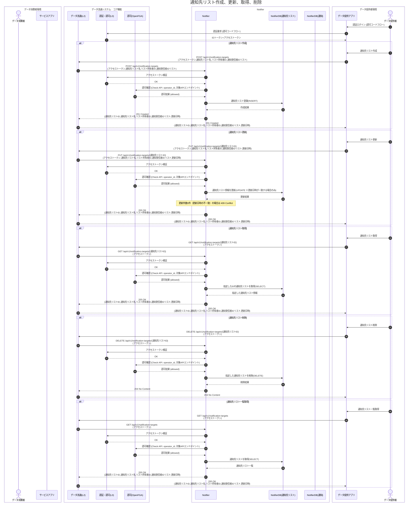
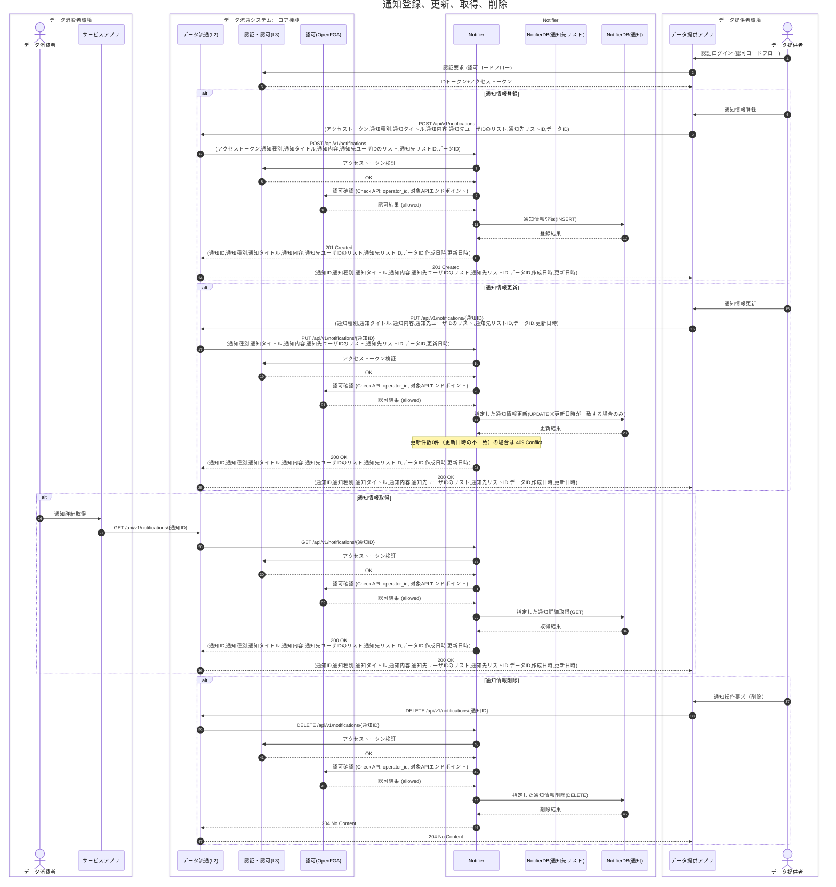
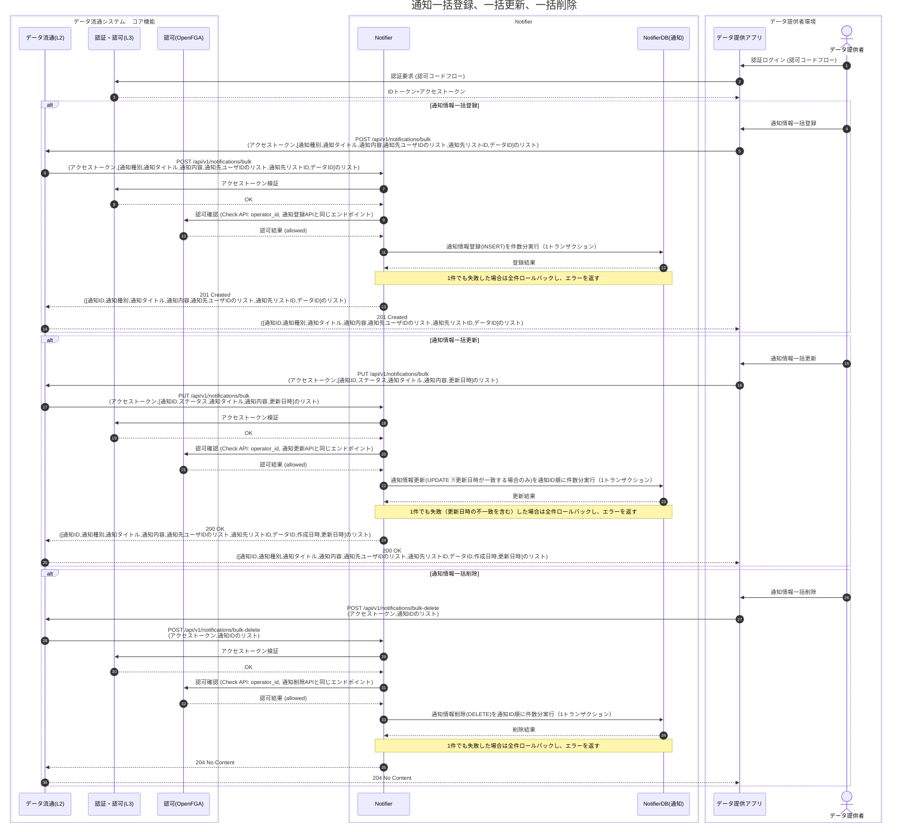
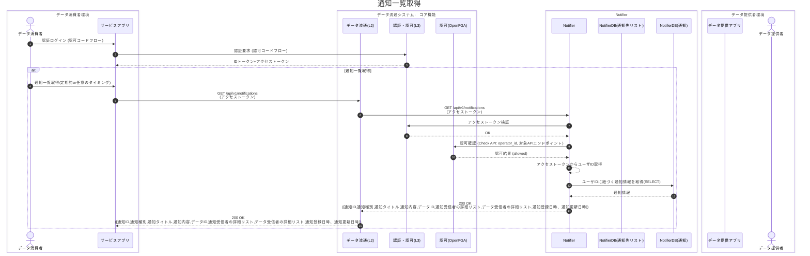
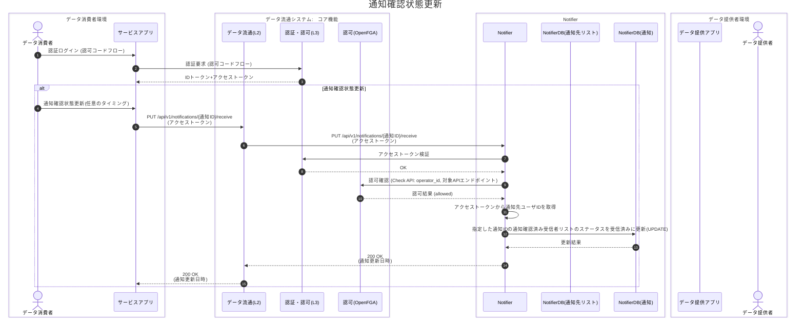
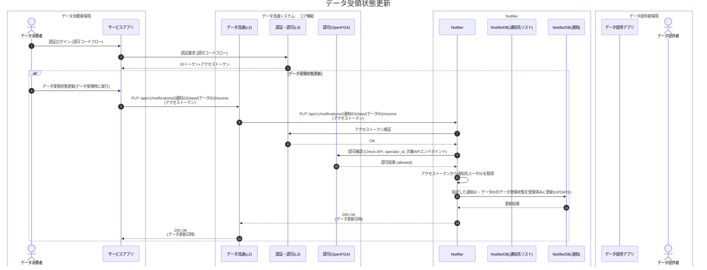

# Notifier 詳細設計

## 1. 詳細シーケンス

### (1) 通知先リスト作成、更新、取得、削除シーケンス



### (2) 通知登録、更新、取得、削除シーケンス



### (2-2) 通知一括登録、一括更新、一括削除シーケンス



### (3) 通知一覧取得シーケンス



### (4) 通知確認状態更新​シーケンス



### (5) データ受領状態更新シーケンス




## 2. 詳細データベース
### 2.1 データベース詳細仕様
#### (1) 通知先リスト `notification_target_list`

| カラム                      | 型            | 制約/既定値                              | 説明       |
| ------------------------ | ------------ | ----------------------------------- | -------- |
| target_list_id | uuid         | **PK**, DEFAULT gen\_random\_uuid() | 通知先リストID |
| name                     | varchar(255) | **NOT NULL**                        | 通知先リスト名称 |
| owner\_id                | varchar(255) | **NOT NULL**                        | リスト所有者ID |
| created\_at              | timestamptz  | **NOT NULL**, DEFAULT now()         | 登録日時     |
| updated\_at              | timestamptz  | **NOT NULL**, DEFAULT now()         | 更新日時     |

```sql
CREATE TABLE IF NOT EXISTS notification_target_list (
  target_list_id uuid PRIMARY KEY DEFAULT gen_random_uuid(),
  name                   varchar(255) NOT NULL,
  owner_id               varchar(255) NOT NULL,
  created_at             timestamptz NOT NULL DEFAULT now(),
  updated_at             timestamptz NOT NULL DEFAULT now()
);
```

---

#### (2) 通知先リスト通知受信者（中間） `target_ids`

| カラム                      | 型           | 制約/既定値                                            | 説明       |
| ------------------------ | ----------- | ------------------------------------------------- | -------- |
| target_list_id | uuid        | **NOT NULL**, **FK → notification\_target\_list** | 通知先リストID |
| target_id               | varchar(255) | **NOT NULL**                                      | 通知受信者ID  |
| created_at              | timestamptz | **NOT NULL**, DEFAULT now()                       | 登録日時     |
| updated_at              | timestamptz | **NOT NULL**, DEFAULT now()                       | 更新日時     |

> 主キー：(`target_list_id`, `target_id`)

```sql
CREATE TABLE IF NOT EXISTS target_ids (
  target_list_id uuid NOT NULL,
  target_id              varchar(255) NOT NULL,
  created_at             timestamptz NOT NULL DEFAULT now(),
  updated_at             timestamptz NOT NULL DEFAULT now(),
  PRIMARY KEY (target_list_id, target_id),
  CONSTRAINT fk_ntidlist_list
    FOREIGN KEY (target_list_id)
    REFERENCES notification_target_list(target_list_id)
    ON DELETE CASCADE
);
```

---

#### (3) 通知情報 `notification`

| カラム                      | 型            | 制約/既定値                                    | 説明               |
| ------------------------ | ------------ | ----------------------------------------- | ---------------- |
| notification_id         | uuid         | **PK**, DEFAULT gen\_random\_uuid()       | 通知ID             |
| type_id       | uuid  | **NOT NULL**, **FK → notification_type**  | 通知種別ID           |
| title      | varchar(500) | **NOT NULL**                              | 通知タイトル           |
| content    | text         | **NOT NULL**                              | 通知内容             |
| target_ids        | varchar(255)\[]      | NULL                              | 通知受信者IDリスト |
| status              | enum | **NOT NULL**, **DEFAULT 'enabled'**       | ステータス（enabled/disabled/deleted） |
| data_id       | varchar(255)         | NULL                              | データID            |
| created\_at              | timestamptz  | **NOT NULL**, DEFAULT now()               | 登録日時             |
| updated\_at              | timestamptz  | **NOT NULL**, DEFAULT now()               | 更新日時             |

> 通知先リストとの関連は中間テーブル `notification_target_list_map` を通じて多対多で管理

```sql
CREATE TABLE IF NOT EXISTS notification (
  notification_id        uuid PRIMARY KEY DEFAULT gen_random_uuid(),
  type_id   uuid NOT NULL REFERENCES notification_type(type_id),
  title     varchar(500) NOT NULL,
  content   text         NOT NULL,
  target_ids        varchar(255)[],
  status  notificationstatus NOT NULL DEFAULT 'enabled',
  data_id       varchar(255),
  created_at             timestamptz  NOT NULL DEFAULT now(),
  updated_at             timestamptz  NOT NULL DEFAULT now(),
  CONSTRAINT check_target_ids_non_empty
    CHECK (array_length(target_ids, 1) > 0 OR target_ids IS NULL)
);

-- ENUM型定義
CREATE TYPE notificationstatus AS ENUM ('enabled', 'disabled', 'deleted');
```

#### (3-2) 通知種別 `notification_type`

| カラム                      | 型            | 制約/既定値                                    | 説明               |
| ------------------------ | ------------ | ----------------------------------------- | ---------------- |
| type_id                  | uuid         | **PK**, DEFAULT gen\_random\_uuid()       | 通知種別ID           |
| type_code                | varchar(100) | **NOT NULL**, **UNIQUE**                  | 通知種別コード         |
| type_name                | varchar(255) | **NOT NULL**, **UNIQUE**                  | 通知種別名            |
| created\_at              | timestamptz  | **NOT NULL**, DEFAULT now()               | 登録日時             |
| updated\_at              | timestamptz  | **NOT NULL**, DEFAULT now()               | 更新日時             |

> `notification.type_id` から FK 参照される

```sql
CREATE TABLE IF NOT EXISTS notification_type (
  type_id        uuid PRIMARY KEY DEFAULT gen_random_uuid(),
  type_code      varchar(100) NOT NULL UNIQUE,
  type_name      varchar(255) NOT NULL UNIQUE,
  created_at     timestamptz NOT NULL DEFAULT now(),
  updated_at     timestamptz NOT NULL DEFAULT now()
);
```

---

#### (3-3) 通知-通知先リスト中間テーブル `notification_target_list_map`

| カラム                      | 型            | 制約/既定値                                    | 説明               |
| ------------------------ | ------------ | ----------------------------------------- | ---------------- |
| notification_id         | uuid         | **PK**, **FK → notification**             | 通知ID             |
| target_list_id          | uuid         | **PK**, **FK → notification\_target\_list** | 通知先リストID       |

> 主キー：(`notification_id`, `target_list_id`)

```sql
CREATE TABLE IF NOT EXISTS notification_target_list_map (
  notification_id uuid NOT NULL,
  target_list_id uuid NOT NULL,
  PRIMARY KEY (notification_id, target_list_id),
  CONSTRAINT fk_map_notification
    FOREIGN KEY (notification_id)
    REFERENCES notification(notification_id)
    ON DELETE CASCADE,
  CONSTRAINT fk_map_target_list
    FOREIGN KEY (target_list_id)
    REFERENCES notification_target_list(target_list_id)
    ON DELETE CASCADE
);
```

---

#### (4) 通知情報確認済み状態 `notification_confirmed`

| カラム                             | 型           | 制約/既定値                              | 説明           |
| ------------------------------- | ----------- | ----------------------------------- | ------------ |
| notification\_id                | uuid        | **NOT NULL**, **FK → notification** | 通知ID         |
| target\_id                      | varchar(255) | **NOT NULL**                        | 受信者ID        |
| status | enum    | **NOT NULL**, DEFAULT 'unconfirmed' | 通知確認状態(confirmed/unconfirmed/deleted) |
| created\_at                     | timestamptz | **NOT NULL**, DEFAULT now()         | 登録日時         |
| updated\_at                     | timestamptz | **NOT NULL**, DEFAULT now()         | 更新日時         |

> 主キー：(`notification_id`, `target_id`)

```sql
-- ENUM型定義
CREATE TYPE confirmationstatus AS ENUM ('confirmed', 'unconfirmed', 'deleted');

CREATE TABLE IF NOT EXISTS notification_confirmed (
  notification_id               uuid       NOT NULL,
  target_id                     varchar(255) NOT NULL,
  status confirmationstatus NOT NULL DEFAULT 'unconfirmed',
  created_at                    timestamptz NOT NULL DEFAULT now(),
  updated_at                    timestamptz NOT NULL DEFAULT now(),
  PRIMARY KEY (notification_id, target_id),
  CONSTRAINT fk_confirmed_notification
    FOREIGN KEY (notification_id)
    REFERENCES notification(notification_id)
    ON DELETE CASCADE
);
```

---

#### (5) データ受領状態 `notification_data_confirmed`

| カラム                     | 型           | 制約/既定値                              | 説明           |
| ----------------------- | ----------- | ----------------------------------- | ------------ |
| notification\_id        | uuid        | **NOT NULL**, **FK → notification** | 通知ID         |
| target\_id              | varchar(255) | **NOT NULL**                        | 受信者ID        |
| status | enum    | **NOT NULL**, DEFAULT 'unconfirmed' | 受信ステータス(confirmed/unconfirmed/deleted) |
| created\_at             | timestamptz | **NOT NULL**, DEFAULT now()         | 登録日時         |
| updated\_at             | timestamptz | **NOT NULL**, DEFAULT now()         | 更新日時         |

> 主キー：(`notification_id`, `target_id`)

```sql
CREATE TABLE IF NOT EXISTS notification_data_confirmed (
  notification_id       uuid       NOT NULL,
  target_id             varchar(255) NOT NULL,
  status confirmationstatus NOT NULL DEFAULT 'unconfirmed',
  created_at            timestamptz NOT NULL DEFAULT now(),
  updated_at            timestamptz NOT NULL DEFAULT now(),
  PRIMARY KEY (notification_id, target_id),
  CONSTRAINT fk_data_confirmed_notification
    FOREIGN KEY (notification_id)
    REFERENCES notification(notification_id)
    ON DELETE CASCADE
);
```

---

#### (6) 参考：推奨インデックス（任意）

```sql
-- target_ids中間テーブル：受信者/リストでの絞り込み
CREATE INDEX IF NOT EXISTS idx_target_ids_target_id ON target_ids (target_id);
CREATE INDEX IF NOT EXISTS idx_target_ids_list_id   ON target_ids (target_list_id);

-- 通知情報：種別・作成日時
CREATE INDEX IF NOT EXISTS idx_notification_type_id ON notification (type_id);
CREATE INDEX IF NOT EXISTS idx_notification_created ON notification (created_at DESC);

-- 個別配信集合の検索（@>, &&, ANY 等）
CREATE INDEX IF NOT EXISTS idx_notification_targets_gin ON notification USING GIN (target_ids);

-- 中間テーブル：通知-通知先リストマッピング
CREATE INDEX IF NOT EXISTS idx_map_notification_id ON notification_target_list_map (notification_id);
CREATE INDEX IF NOT EXISTS idx_map_target_list_id ON notification_target_list_map (target_list_id);

-- 確認/受信状態：受信者別・更新日時
CREATE INDEX IF NOT EXISTS idx_confirmed_target    ON notification_confirmed (target_id);
CREATE INDEX IF NOT EXISTS idx_confirmed_updated   ON notification_confirmed (updated_at);
CREATE INDEX IF NOT EXISTS idx_data_confirmed_target ON notification_data_confirmed (target_id);
CREATE INDEX IF NOT EXISTS idx_data_confirmed_updated ON notification_data_confirmed (updated_at);
```

### 2.2 排他制御仕様

#### 基本方針
`updated_at`フィールドを楽観的排他制御のバージョン識別子として使用し、データの競合状態を検知・防止する。
更新API（PUT）のリクエストボディには、取得時の`updated_at`を必須項目として指定する。

#### 管理対象テーブル
| テーブル | updated_at列仕様 | デフォルト値 | 対象API | 備考 |
|----------|-----------------|-------------|---------|------|
| notification | timestamptz NOT NULL DEFAULT now() | now() | PUT /api/v1/notifications/{notification_id}<br>PUT /api/v1/notifications/bulk | 通知データ |
| notification_target_list | timestamptz NOT NULL DEFAULT now() | now() | PUT /api/v1/notification-targets/{target_list_id} | 通知先リスト。通知受信者（target_ids）の洗い替えも同じ排他制御の範囲で行う |

> 削除API、通知確認状態更新API、データ受領状態更新APIは排他制御の対象外とする。

#### 更新処理フロー

#### (1). データ読み取り段階
- 取得APIのレスポンスで対象データと`updated_at`を同時に取得
- API呼び出し元で`updated_at`の値を保持
- この段階ではロックは発生しない

```sql
SELECT notification_id, title, content, updated_at 
FROM notification 
WHERE notification_id = ?;

SELECT target_list_id, name, owner_id, updated_at 
FROM notification_target_list 
WHERE target_list_id = ?;
```

#### (2). 更新処理段階
- 更新APIのリクエストボディに、保持していた`updated_at`を取得した値のまま指定（マイクロ秒まで比較する）
- 更新実行時に以下の条件で実行
```sql
UPDATE notification 
SET title = ?, content = ?, status = ?, updated_at = now() 
WHERE notification_id = ? AND status <> 'deleted' AND updated_at = ?;

UPDATE notification_target_list 
SET name = ?, owner_id = ?, updated_at = now() 
WHERE target_list_id = ? AND updated_at = ?;
-- 更新件数が1件の場合のみ、続けて target_ids を洗い替える（DELETE → INSERT）
```
- WHERE条件で元の`updated_at`をチェック
- 更新件数が0件の場合、対象データが存在しなければ404（該当データなし）、存在すれば競合発生と判定

#### (3). 競合処理段階
- 競合検出時はHTTPステータス409（Conflict）で応答
- エラーレスポンスの detail に、送信された`updated_at`（Expected）と現在の`updated_at`（Actual）を含め、最新データの再取得を促す
- 一括更新APIでは、1件でも競合した場合は全件をロールバックし、409で応答する
- エラーレスポンス例
```json
{
  "type": "conflict",
  "title": "Conflict",
  "detail": "Version mismatch for Notification(550e8400-e29b-41d4-a716-446655440000). Expected: 2024-01-15T10:30:15.123000, Actual: 2024-01-15T10:35:22.456000",
  "status": 409,
  "instance": "/api/v1/notifications/550e8400-e29b-41d4-a716-446655440000"
}
```

## 3. ログ設計

### 3.1 設計思想
- **構造化ログ**: JSON形式での統一出力（本番環境）/ 人間可読形式（開発環境）
- **1行1JSON**: 各ログエントリは1行で完結し、改行文字を含まない
- **トレーサビリティ**: X-TrackingIdヘッダによる一連の処理追跡

### 3.2 ログ出力先

| 出力先 | 出力内容 | 形式 | 備考 |
|--------|----------|------|------|
| stdout | INFO以下のログ | JSON/テキスト | コンソールハンドラ |
| stderr | ERROR以上のログ | JSON/テキスト | エラーコンソールハンドラ |
| ファイル | 全ログ（任意） | JSON | LOG_FILE_ENABLED=true時 |

### 3.3 環境変数設定

| 環境変数 | デフォルト値 | 説明 |
|----------|-------------|------|
| LOG_LEVEL | INFO | ログレベル |
| LOG_JSON_FORMAT | true | JSON形式出力（本番向け） |
| LOG_FILE_ENABLED | false | ファイル出力有効化 |
| LOG_FILE_PATH | /var/log/app/app.log | ログファイルパス |
| ERROR_LOG_FILE_PATH | /var/log/app/error.log | エラーログファイルパス |
| LOG_FILE_MAX_BYTES | 10485760 | ローテーションサイズ（10MB） |
| LOG_FILE_BACKUP_COUNT | 5 | バックアップ世代数 |
| LOG_COLORIZE | true | カラー出力（開発環境向け） |
| APP_NAME | notifier-api | アプリケーション名 |
| SQLALCHEMY_LOG_LEVEL | WARN | SQLAlchemyログレベル |
| UVICORN_LOG_LEVEL | INFO | Uvicornログレベル |

### 3.4 リクエストトレーシング

- **X-TrackingId**: リクエストヘッダから取得、レスポンスヘッダにも付与
- **TrackingMiddleware**: リクエスト/レスポンスのログ出力を担当
- **ContextVar**: スレッドセーフなリクエストID伝播

```python
# ログ出力例（サービス層）
logger.info(
    "Starting notification creation",
    notification_id=request.notification_id,
    target_list_id=request.target_list_id,
    type=request.type
)
```

### 3.5 JSONL ログ仕様

#### (1) 基本構造（JSON形式）
各ログエントリは以下の構造を持つ1行のJSONオブジェクト：

```json
{"timestamp":"2024-01-15T10:30:45.123Z","level":"INFO","logger":"app.services.notification","message":"Starting notification creation","module":"notification_service","function":"create_notification","line":45,"thread":12345,"thread_name":"MainThread","app":{"name":"notifier-api","environment":"production"},"request_id":"abc-123-def","notification_id":"notif_001","target_list_id":"list_001"}
```

#### (2) ログ出力仕様
- **改行文字の禁止**: ログメッセージ内の改行文字（\n, \r）はエスケープ（\\n, \\r）
- **スタックトレース**: 複数行のスタックトレースは1つの文字列内でエスケープ
- **JSONエスケープ**: 特殊文字は適切にエスケープ処理
- **UTF-8**: すべてのログはUTF-8エンコーディング
- **BOM無し**: Byte Order Markは使用しない

#### (3) 必須フィールド定義
| フィールド名 | 型 | 必須 | 説明 | 例 |
|--------------|----|----|------|-----|
| timestamp | string | ○ | ISO8601形式のタイムスタンプ | 2024-01-15T10:30:45.123Z |
| level | string | ○ | ログレベル | INFO, WARN, ERROR |
| logger | string | ○ | ロガー名（モジュールパス） | app.services.notification |
| message | string | ○ | ログメッセージ | Starting notification creation |
| module | string | ○ | モジュール名 | notification_service |
| function | string | ○ | 関数名 | create_notification |
| line | number | ○ | 行番号 | 45 |

#### (4) アプリケーションフィールド
| フィールド名 | 用途 | データ型 | 例 |
|--------------|------|----------|-----|
| app.name | アプリケーション名 | string | notifier-api |
| app.environment | 実行環境 | string | production |
| request_id | リクエスト追跡ID（X-TrackingId） | string | abc-123-def |

#### (5) コンテキストフィールド（オプション）
| フィールド名 | 用途 | データ型 | 例 |
|--------------|------|----------|-----|
| notification_id | 通知ID | string | uuid |
| target_list_id | 通知先リストID | string | uuid |
| target_id | 通知受信者ID | string | uuid |
| method | HTTPメソッド | string | POST |
| path | リクエストパス | string | /api/v1/notifications |
| status_code | レスポンスコード | number | 201 |
| process_time_sec | 処理時間（秒） | number | 0.145 |
| error_type | エラー種別 | string | ValidationError |
| error_message | エラーメッセージ | string | Invalid format |

#### (6) 例外情報フィールド（エラー時）
| フィールド名 | 用途 | データ型 | 例 |
|--------------|------|----------|-----|
| exception.type | 例外クラス名 | string | ValueError |
| exception.message | 例外メッセージ | string | Invalid input |
| exception.traceback | スタックトレース | string | Traceback... |

#### (7) ログレベル定義

| レベル | 用途 | 出力条件 |
|--------|------|----------|
| DEBUG | 詳細なデバッグ情報 | 開発環境のみ |
| INFO | 正常な処理の記録 | 全環境 |
| WARNING | 注意が必要な状況 | 全環境 |
| ERROR | エラーが発生した状況 | 全環境 |
| CRITICAL | システム停止レベル | 全環境 |

### 3.6 ミドルウェアによるログ出力

#### TrackingMiddleware
| タイミング | レベル | 出力内容 |
|-----------|--------|----------|
| リクエスト受信 | INFO | method, path, client_host, tracking_id |
| レスポンス送信 | INFO | status_code, process_time_sec |

#### ErrorHandlerMiddleware
| エラー種別 | レベル | 出力内容 |
|-----------|--------|----------|
| ValidationError | WARNING | errors |
| ApplicationError | ERROR | error_code, message, exception_class, status_code |
| HTTPException | WARNING/ERROR | status_code, detail |
| DatabaseError | ERROR | error, traceback |
| 未処理例外 | ERROR | traceback |


---

## 4. 改訂履歴

| 版   | 日付         | 変更点                                                                                                       |
| --- | ---------- | --------------------------------------------------------------------------------------------------------- |
| 1.0 | 2026-02-28 | 第1.0版 |
| 1.1 | 2026-08-31 | 第1.1版 |
| 1.2 | 2026-09-30 | 第1.2版 |

---


